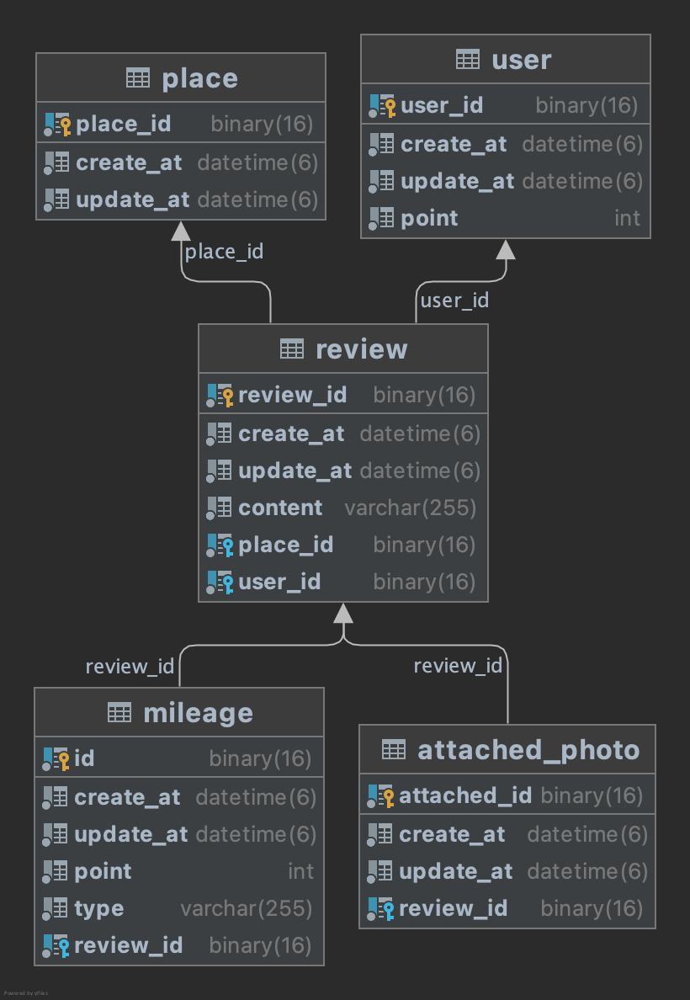

# Triple Submission
---
> 이번 리포지토리는 테스트 주도 개발로 진행한 프로젝트 입니니다.
> 포인트 도메인의 이름이 Mileage로 설정되어 있습니다.

## 프로젝트 전제조건
---
이 마일리지 조회 API 설계는 장소, 리뷰, 사용자, 사진 등의 CRUD가 전제되어 있어야합니다.

이 리포지토리에서는 간략하게나마 API 설계와 테이블을 설계했지만 실제와는 차이가 있습니다.

<strong>마일리지 생성의 경우 호출 시점이 리뷰 생성 직후라고 판단되었습니다.</strong>

그렇게 생각한 데는 두가지 이유가 있습니다.

1. 리뷰가 생성되지 않았다면 리뷰 ID를 얻을 수 없다.
2. 만약 리뷰 ID가 자동생성이 아니라 외부 주입이라면 장소 ID가 생성된 후여야 하는데, 장소가 리뷰를 참조하고 있는 상황에서 장소에 대한 리뷰가 있는지 없는지 여부를 알 수 없다.

<strong>마일리지 생성 호출 시점이 리뷰 생성 직후라면 다음과 같은 것들이 가능해집니다.</strong>

1. 마일리지를 생성하려는 리뷰를 작성한 사용자와 마일리지 생성 사용자가 일치하는지 검사
2. 마일리지를 생성하려는 리뷰의 장소와 리뷰 전달받은 장소가 일치하는지 검사
3. 리뷰 ID를 통한 마일리지가 존재하는지 검사

<strong>마일리지 수정, 삭제의 경우 호출 시점이 리뷰 수정, 삭제  직전이라고 판단되었습니다.</strong>

그렇게 생각한데는 3가지 이유가 있습니다.

1. 기존의 리뷰와 새로 작성하려는 리뷰의 내용 차이 검출.
2. 기존의 리뷰와 새로 작성하려는 리뷰의 사진 차이 검출.
3. 기존의 리뷰와 새로 작성하려는 리뷰의 장소 순서 차이 검출.

만약 수정, 삭제 직후에 이 API를 호출한다면 이전의 차이를 비교할 수 없게되고, 사용자 마일리지를 수정할 수 없습니다.

호출 시점을 수정, 삭제 직전으로 했기 떄문에
사용자의 점수 감소 뿐만 아니라 증가도 확인할 수 있습니다.

<strong> 마일리지 삭제와 리뷰 삭제는 별개입니다. </strong>

마일리지 삭제는 마일리지 도메인에서 이루어지는 것이 맞고,

리뷰 삭제는 리뷰 도메인에서 이루어지는 것이 맞다고 생각했습니다.

그래서 마일리지 삭제 과정에서 리뷰가 삭제되는 과정을 제외했습니다.

완전한 삭제의 순서는 다음과 같습니다.

마일리지 삭제 호출 -> (다른 도메인에서) 리뷰 삭제 호출 -> 동시에 사용자의 리뷰 리스트, 장소의 리뷰 리스트에서도 삭제 -> 삭제 완료.

이 도메인은 <strong>포인트</strong>만을 관리하기 때문에

오직 사용자의 포인트에만 관심이 있고, 사용자의 포인트 만을 수정했습니다.

### 구현 요구사항
---
* `POST /events`로 호출하는 포인트 적립 API 
* 포인트 조회 API
* 포인트 증감에 따라 로그 기록
* 테이블 인덱스 설정
* 사용자 포인트 총점 조회
* 리뷰를 수정하면 수정에 따른 포인트 회수 및 부여
* 사용자에서 첫 리뷰일 때 보너스 점수 부여

### API docs
---
##### 포인트 조회 API
생성된 마일리지 포인트의 점수 조회
* `GET /events/{mileage_id}` 로 조회 가능 -> int 반환

 

사용자 포인트 총점 조회

* `GET /users/{user_id}`로 조회 가능 -> int 반환

##### 포인트 관련 API
* `POST /events + body`로 생성, 수정, 삭제 가능
* body의 action에 따라 분류

##### 그외 API

* 사용자 생성 `POST /users`
* 사용자 조회 `GET /users{user_id}`
* 장소 생성 `POST /places`
* 장소 조회 `GET /places/{place_id}`
* 리뷰 생성 `POST /reviews + body`
* 사진 조회 `GET /photos/{photo_id}`

### 작성된 테스트 코드 및 테스트 케이스
---
#### mileage
##### controllers
- [x] 올바른 타입으로 마일리지(포인트) 생성(이하 마일리지)

- [x] 올바르지 않은 타입으로 마일리지 생성

- [x] 존재하는 마일리지를 업데이트 하는 경우

- [x] 존재하는 마일리지의 id로 포인트를 삭제하는 경우

- [x] 존재하는 마일리지의 id로 포인트를 조회하는 경우

##### services

- [x] 올바른 데이터로 장소의 첫 리뷰를 생성하고, 길이 1이상의 콘텐츠, 빈 사진 리스트로 마일리지를 생성하는 경우 2점을 획득

- [x] 올바른 데이터로 장소의 두번째 리뷰를 생성하고, 길이 1이상의 콘텐츠, 빈 사진 리스트로 마일리지를 생성하는 경우 1을 획득한다.

- [x] 존재하는 id로 마일리지를 조회하는 경우 올바른 마일리지를 반환한다.

- [x] 올바른 데이터로 마일리지를 수정하는 경우 수정 된 객체를 반환한다.

- [x] 올바른 데이터로 마일리지를 삭제하는 경우

#### review
##### controllers
- [x] 올바른 데이터로 리뷰를 생성할 경우

##### services
- [x] 올바른 ID로 리뷰를 조회하면 리뷰 객체를 반환한다.

- [x] 올바르지 않은 ID로 리뷰를 조회하면 에러를 발생시킨다.

- [x] 존재하는 유저와 존재하는 장소로 리뷰를 생성하면 리뷰 객체를 생성하고 반환한다.

#### place
##### controllers
- [x] 올바른 id로 장소를 조회하는 경우 객체를 반환한다.

- [x]장소를 생성하는 경우 장소를 반환한다.

##### services

- [x] 올바른 ID로 장소를 조회하면 장소 객체를 반환한다.

- [x] 올바르지 않은 ID로 장소를 조회하면 에러를 날린다.

- [x] 장소를 생성한다.

#### user
##### controllers
- [x] 올바른 ID로 사용자를 조회하려하면 사용자 객체를 반환한다.

- [x] 올바르지 ID로 사용자를 조회하려하면 에러를 던진다.

- [x] 사용자를 생성하면 사용자를 반환한다.

- [x] 올바른 사용자의 ID로 총점을 조회하면 사용자의 총점을 반환한다.

##### services
- [x] 올바른 id로 사용자를 조회하면 id와 일치하는 사용자를 반환한다.

- [x] 올바르지 않은 id로 사용자를 조회하면 에러를 발생시킨다.

- [x] 삭제된 사용자의 id로 사용자를 조회하면 에러를 발생시킨다.

- [x] 사용자를 생성하면 객체를 반환한다.

#### attachedPhoto
##### controllers
- [x] 올바른 id로 사진을 조회하면 id와 일치하는 사진 객체 반환한다.

##### services
- [x] 올바른 id list로 사진을 조회하면 일치하는 사진 list를 반환한다.

- [x] 올바르지 않은 id로 사진을 조회하면 에러를 발생시킨다.

### 데이터 베이스 설계
---
<strong>ER Diagram</strong>

DDL 은 src/main/resources/schema 폴더에 있습니다.

 

### 사용 기술
---
* Spring boot
* Spring data jpa
* Spring MVC
* MySQL

